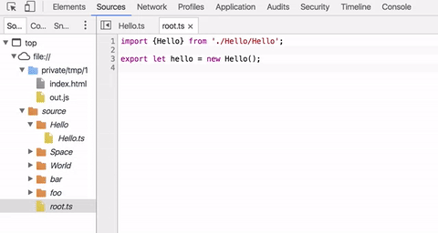

# ts-universal (gulp plugin)

A simple gulp plugin that makes it possible to use typescript modules painlessly on browser and on server



## Features

* Converts typescript output into a unversal module (1 file)
* Exposes targets naturaly to window or NodeJS exports
* 100% Typescript sourcemaps support
* Simplicity - 2 variables to configure
* No extra libraries required!


## How it works

*tsUniversal* Wraps each file into a neat closure, providing custom exports and require function, that work flawlessly in both ends
```js
 __ts.module("utils/utils.js", function(exports, require) {
     "use strict";
     const misc = require('./misc');
     exports.something = {};
})
```

## Try it now!
* Clone this repository
* Run npm install && gulp
* NodeJS: node [build/test.js](build/test.js)
* Browser: launch [build/index.html](build/index.html) in your browser

## Install it

```js
npm install ts-universal --save-dev
```

## Gulp Build example

```js
const gulp = require('gulp');
const rename = require("gulp-rename");
const ts = require('gulp-typescript');
const tsUniversal = require("./index.js");
const sourcemaps = require('gulp-sourcemaps');
const tsProject = ts.createProject('example/tsconfig.json');
gulp.task('default', function() {
   return gulp.src('example/**/*.ts')
      .pipe(sourcemaps.init())
      .pipe(ts(tsProject))
       
       .pipe(tsUniversal('build/', { // ALL YOU NEED
         base: 'build/',
         expose: 'root'
       }))
      
      .pipe(rename('out.js'))
      .pipe(sourcemaps.write())
      .pipe(gulp.dest('build/'));
});

```

## Win

*out.js* can be required with "root.ts" exposed both to front end and backend!

To test in on server:

```bash
node build/test.js
```

On browser -> just open [build/index.html](build/index.html) in your browser!
